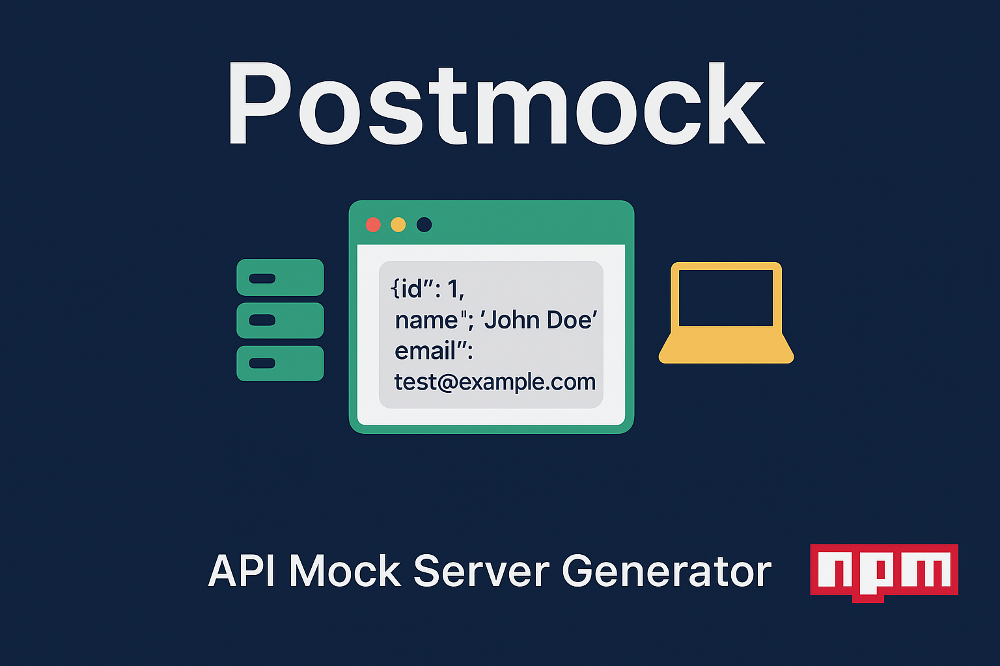

# PostMock

> **Instant Mock API Server Generator** - Create mock servers from Postman collections or OpenAPI specs in seconds!



[](https://www.npmjs.com/package/postmock)
[](https://www.npmjs.com/package/postmock)
[](https://github.com/leon-99/postmock/blob/main/LICENSE)
[](https://github.com/leon-99/postmock/issues)
---

**PostMock** is a powerful interactive CLI tool that instantly generates mock API servers from your existing Postman collections or OpenAPI specifications. Perfect for frontend development, testing, and prototyping when you need a working API server without waiting for backend implementation.

## ✨ Features

- 🚀 **Instant Setup** - Generate a mock server in seconds
- 📚 **Multiple Formats** - Support for Postman (.json) and OpenAPI (.yaml/.yml/.json)
- 🎭 **Smart Mocking** - Uses existing examples or generates realistic fake data
- 🔄 **Dynamic Responses** - Generate different responses for each request
- ⚡ **Hot Reload** - Automatically restart server when files change
- 🎯 **CORS Support** - Built-in CORS for frontend integration
- ⏱️ **Delay Simulation** - Simulate network latency
- 🐳 **Docker Ready** - Easy containerization
- 📊 **Health Checks** - Built-in health monitoring endpoints
- 💬 **Interactive CLI** - User-friendly prompts for all configuration options

## 🚀 Quick Start

### Installation

```bash
npm install -g postmock
```

### Basic Usage

Simply run the command and follow the interactive prompts:

```bash
postmock
```

The CLI will guide you through:
- Selecting your input file (Postman collection or OpenAPI spec)
- Choosing the port number
- Setting up delay simulation
- Enabling dynamic responses
- Configuring CORS
- Setting up hot reload

### Example Interactive Session

```
🚀 Welcome to PostMock!
Generate mock API servers from Postman collections or OpenAPI specs

? Enter the path to your Postman collection (.json) or OpenAPI spec (.yaml/.json) file: examples/postman.json
? What port would you like to run the server on? 4000
? Enter simulated delay range in milliseconds (e.g., 100-300) or press Enter for no delay: 0
? Would you like to generate random responses for every request? No
? Enable CORS for cross-origin requests? Yes
? Enable hot reload to watch for file changes and restart server? No

✅ Mock API server running on http://localhost:4000
```

## 📖 Configuration Options

The interactive CLI will prompt you for the following settings:

| Setting | Description | Default |
|---------|-------------|---------|
| **Input File** | Path to your Postman collection or OpenAPI spec | Required |
| **Port** | Port to run server on | `4000` |
| **Delay Simulation** | Simulated delay range in ms (e.g., `100-300`) | `0` (no delay) |
| **Dynamic Responses** | Generate random responses every request | `false` |
| **CORS** | Enable CORS for cross-origin requests | `true` |
| **Hot Reload** | Watch for file changes and restart server | `false` |

## 🔧 Examples

### Simple Mock Server
```bash
postmock
# Follow prompts to select your API file
# Server starts on default port 4000
```

### Custom Configuration
```bash
postmock
# Select your OpenAPI spec file
# Choose port 5000
# Enable dynamic responses
# Set delay to 200-500ms
# Enable hot reload
```

## 📁 Input File Formats

### Postman Collection
```json
{
  "info": {
    "name": "My API Collection"
  },
  "item": [
    {
      "name": "Get Users",
      "request": {
        "method": "GET",
        "url": {
          "raw": "{{baseUrl}}/users",
          "host": ["{{baseUrl}}"],
          "path": ["users"]
        }
      },
      "response": [
        {
          "body": "{\"users\": [{\"id\": 1, \"name\": \"John Doe\"}]}"
        }
      ]
    }
  ]
}
```

### OpenAPI Specification
```yaml
openapi: 3.0.0
info:
  title: My API
  version: 1.0.0
paths:
  /users:
    get:
      summary: Get users
      responses:
        '200':
          description: Successful response
          content:
            application/json:
              example:
                users:
                  - id: 1
                    name: John Doe
```

## 🎯 Use Cases

### Frontend Development
- Start building frontend immediately without waiting for backend
- Test API integrations with realistic data
- Develop offline-first applications

### Testing & QA
- Create consistent test environments
- Test error handling with controlled responses
- Performance testing with configurable delays

### Prototyping
- Demo API contracts to stakeholders
- Rapid API design iteration
- Proof of concept development

### CI/CD
- Automated testing against mock APIs
- Consistent test environments
- No external dependencies

## 🔌 API Endpoints

### Health Check
```
GET /_health
```
Returns server status and endpoint count.

### Mock Endpoints
All endpoints defined in your input file will be automatically created with appropriate HTTP methods and paths.

## 🤝 Contributing

We welcome contributions! Please feel free to submit a Pull Request.

1. Fork the repository
2. Create your feature branch (`git checkout -b feature/amazing-feature`)
3. Commit your changes (`git commit -m 'Add some amazing feature'`)
4. Push to the branch (`git push origin feature/amazing-feature`)
5. Open a Pull Request

## 📄 License

This project is licensed under the MIT License - see the [LICENSE](LICENSE) file for details.

---

<div align="center">

**Happy Mocking! 🎭**

[Install Now](https://www.npmjs.com/package/postmock) • [View on GitHub](https://github.com/leon-99/postmock) • [Report Bug](https://github.com/leon-99/postmock/issues)

---

**Made with ❤️ by Win Khant Aung**

</div>
